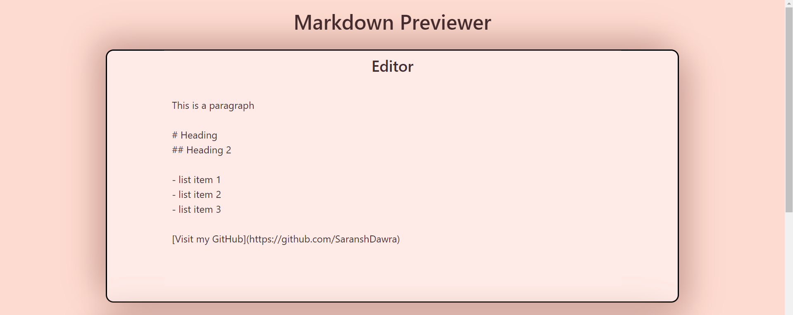
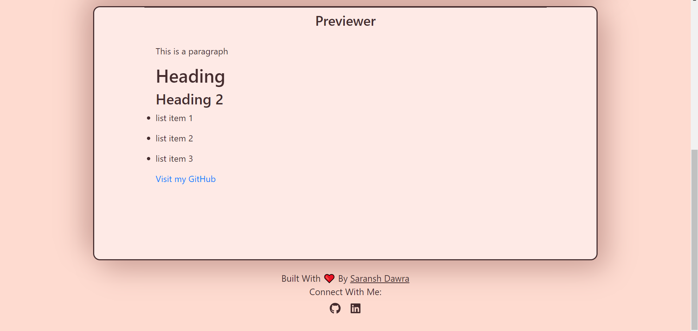

# Markdown-Previewer

* Pomodoro Clock App is a customizable pomodoro timer that works on desktop & mobile browser.
* Realtime preview of markdowns

### View Live Demo
<pre><a href="https://markdown-previewer-ruddy.vercel.app/"><b>https://markdown-previewer-ruddy.vercel.app</b></a></pre>

### Images
<details>
  <summary>Editor</summary>
  
</details>

<details>
  <summary>Previewer</summary>
  
</details>


## Setup
#### Clone this repository
```bash
git clone https://github.com/SaranshDawra/Markdown-Previewer.git
```
#### Move to desired directory
```bash
cd Markdown-Previewer
```
#### To install the dependencies
```bash
npm install
```
#### To run the app
```bash
npm start
```

## Learn More

You can learn more in the [Create React App documentation](https://facebook.github.io/create-react-app/docs/getting-started).
<br>
To learn React, check out the [React documentation](https://reactjs.org/).


##### Made with ♥ by <a href="https://www.linkedin.com/in/saranshdawra/">Saransh Dawra</a>

[](https://github.com/SaranshDawra)